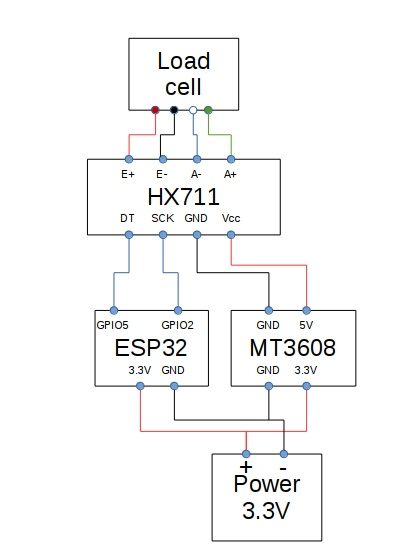

# ESPresso32

The goal of this project is to create a espresso scale based on a ESP32 with
a coresponding Android App and BLE connection.

The ESP32 is programmed with the Andrino IDE.

## ESP32

### Software
You need the Arduino IDE to flash the software.
Simple flash the espresso32.ino file this is all.

Now you can install the Android app or use direct BLE
to communicate with the scale.

### Hardware setup
Beside of the software i have use a simple hardware setup which should only be a example without warranty.

#### List of components
Below you see a list of compnent i have used.
The advantage of the lifepo4 accumulator are that they deliver a voltage from 
max 3.6V which is the max voltage the ESP32 can be run direct on the 3.3V input.
So i was able to omitting one voltage converter.

- ESP32
- Load cell
- HX711
- Battery holder
- lifepo4 accumulator
- Step up (MT3608)
- Housing
- Other small parts like wires etc

This is only a  simple example there for sure other setups possible.

#### Schematic

## Android
To use the android application you need a phone with **Bluetooth Low Energy**.

You can install the app from the [Playstore](https://github.com/epplerc/ESPresso32) or build the app from the source.

If you want to build your application from the source you can do this.
The code is located in the folder  **[android](android)**.

## Bluetooth

### Service
The service uuid from the scale is **dff971a9-142a-4021-a8d2-f5298ab2bdbb**.

### Characteristics
Name | UUID | Read/Write  | Description | Value
------ | ------| ------| ------| ------
Settings   | 76053035-3aa1-4148-a70d-a73e35332418| x/x| Set the modus of the scale| tare, WEIGHT_MODUS, ESPRESSO_MODUS, CALIBRATION_MODUS
Status   | c5c78e8f-5963-4642-bd24-bbb8507e22ca|  x/-| Show the status of the scale|
Calibration weight   | 18d456b3-3c7b-43fa-9d3c-db867d2a93b2|  x/x| Calibration weight | Weight in g|
Calibration value   | e5c96eed-c523-4e81-9d8b-1f92f58603dc| x/x| Set a calibration value of get the determined one | 
Weight   | 2A98| x/-| Weight| Weight in g
Espresso weight   | d0dac8e6-cf56-4e0c-9823-0aed58dc9bfe|  x/-| The weight in g of espresso| 
Espresso time  | 6e980e27-b771-485a-8396-42f1dab56506|  x/-| Time| 

